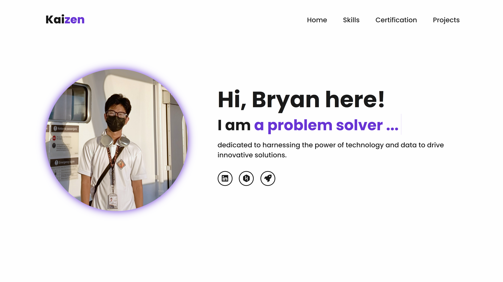
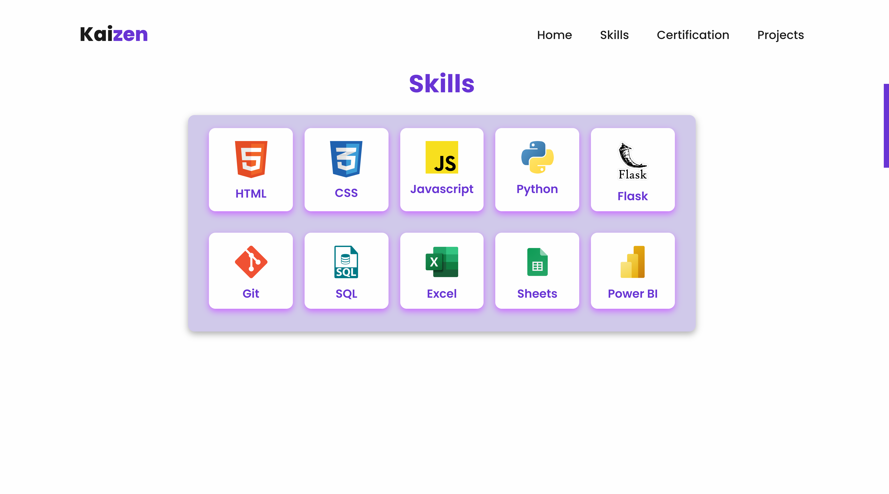
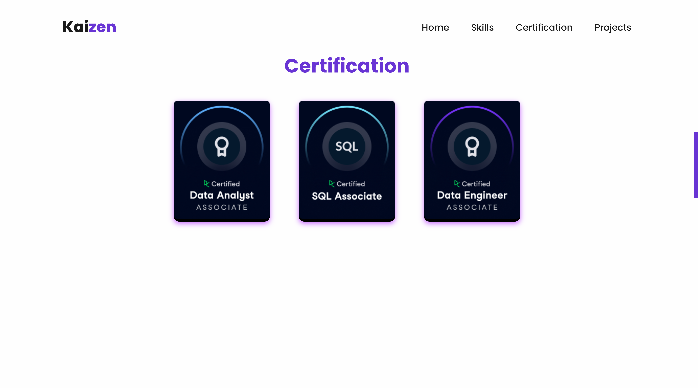
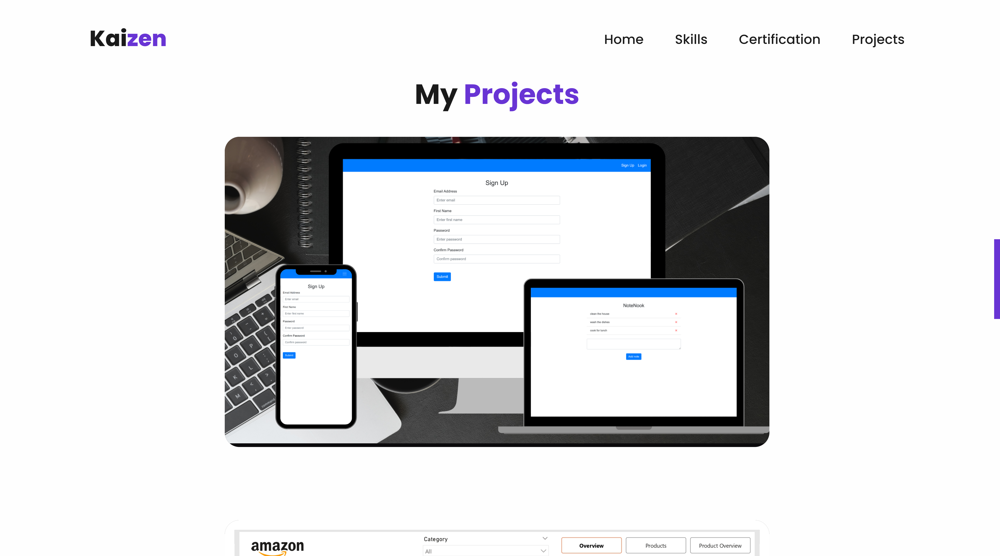

# **Kaizen** - My Personal Portfolio

Welcome to my personal portfolio, **"Kaizen"**. This website showcases my skills and projects, reflecting my journey and growth in tech.

## Introduction
Hello! I'm Bryan, a passionate and dedicated tech enthusiast. I built this portfolio website to share my work and achievements. It reflects my commitment to continuous improvement and professional growth.

## Why "Kaizen"?
"Kaizen" is a Japanese term that means "continuous improvement." I chose this name because it represents my philosophy of consistently striving to enhance my skills, knowledge, and the quality of my work.

## Features

- User-friendly interface
- Responsive design
- Showcase of my skills

- Showcase of my certifications

- Detailed descriptions of my projects

## Technologies Used

- HTML5
- CSS3
- JavaScript

## Hosting

It's currently hosted on Vercel. Visit [here](https://brypin-kaizen.vercel.app/#home).

## Future Plans

- Add a dark theme
- Improve UI

## Contact
Feel free to connect with me on [Linkedin](https://www.linkedin.com/in/bryan-pining).
